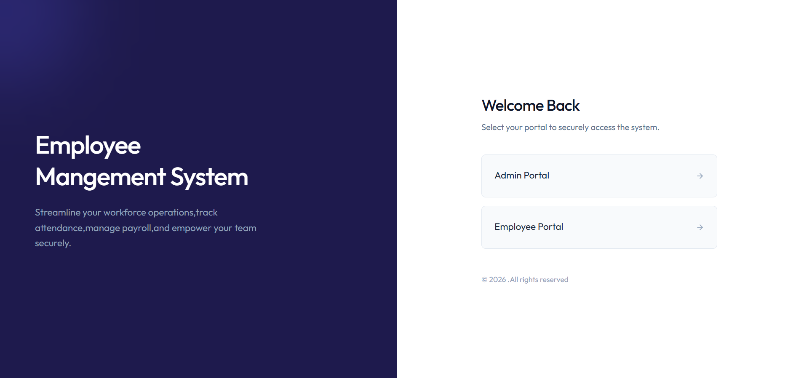
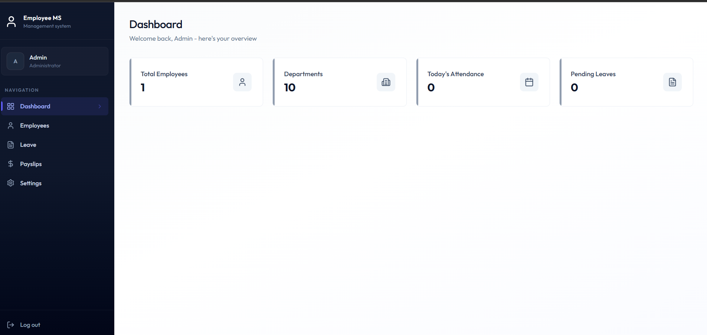
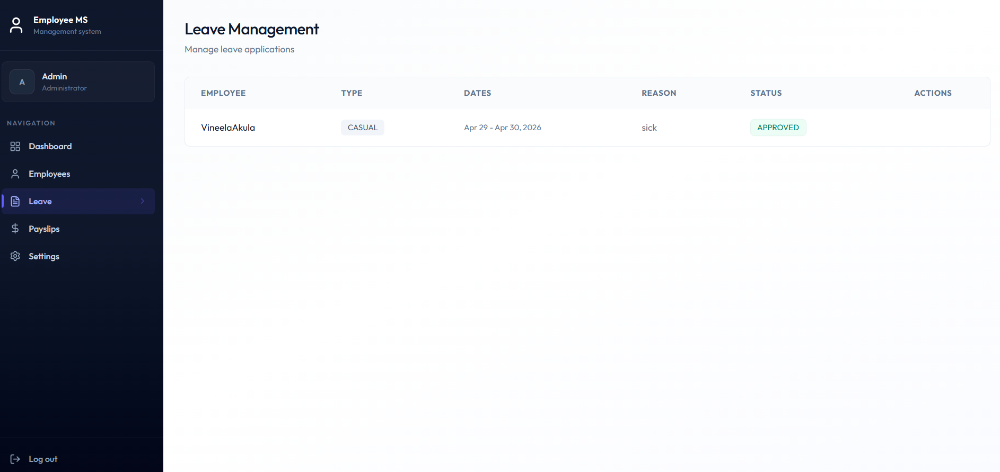
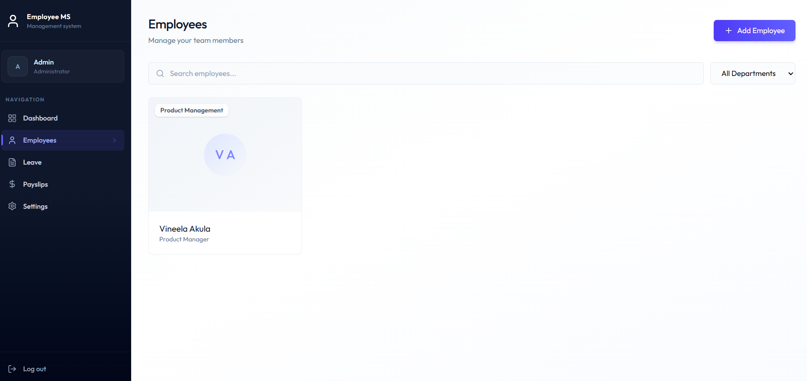
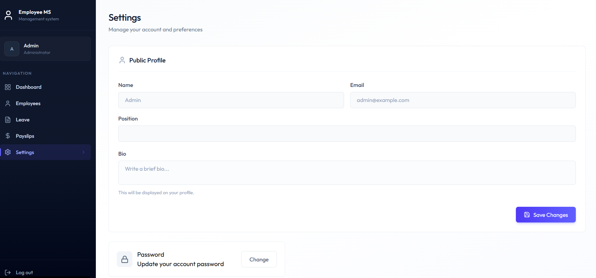
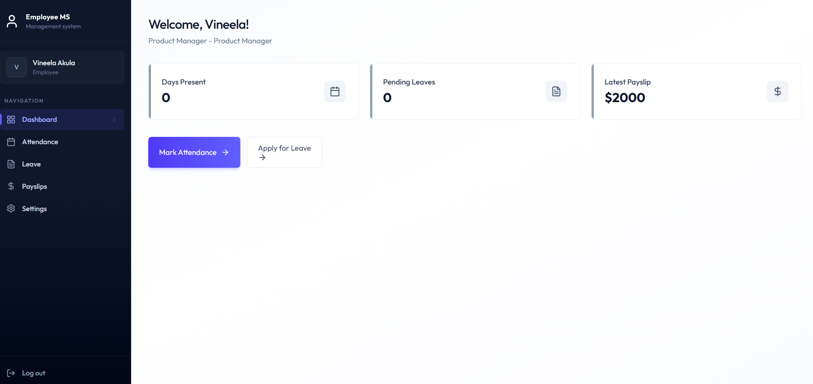
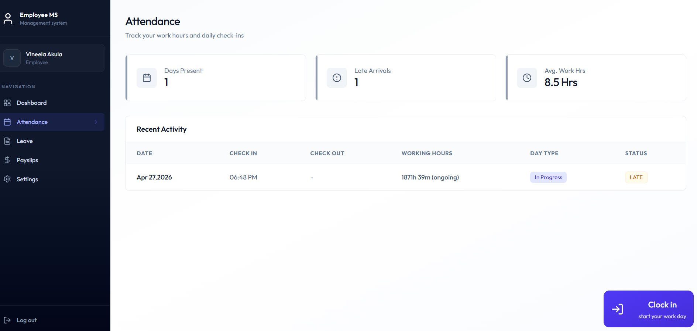
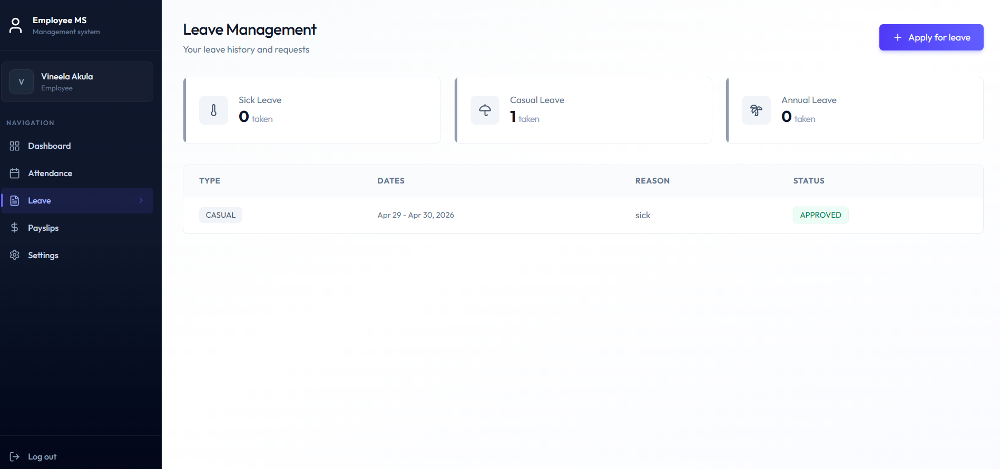
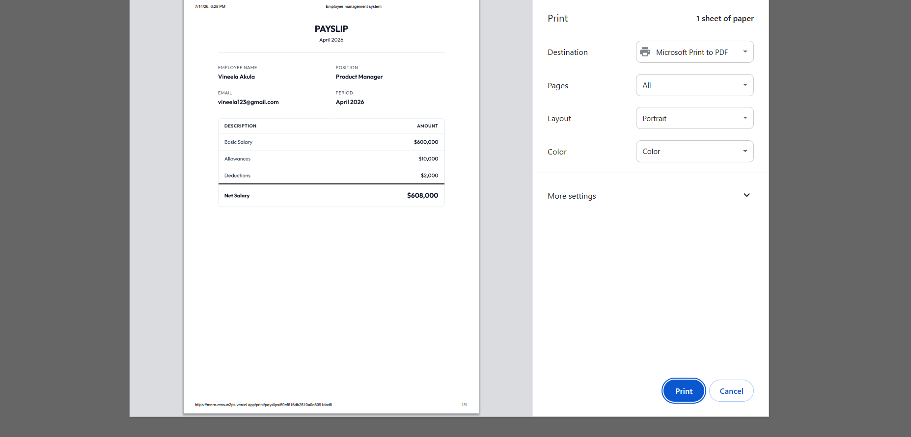
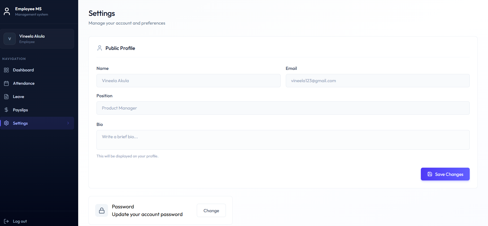

# EMS — Employee Management System 

EMS is a full-stack MERN Employee Management System with role-based access for Admins and Employees. It handles employee records, attendance (clock in/out), leave applications, and payslips, with automated email reminders powered by background jobs.

# Features


- Role-Based Authentication — JWT-based login with ADMIN and EMPLOYEE roles, plus secure password change
- Employee Management — Admins can create, update, and remove employee records (department, position, salary, status)
- Attendance Tracking — Employees clock in/out; status auto-calculated (Present, Late, Absent) with working hours and day type
- Leave Management — Employees apply for leave (Sick, Casual, Annual); admins approve or reject requests
- Payslip Generation — Admins generate monthly payslips with basic salary, allowances, deductions, and net salary; employees view/print their own
- Dashboard — Role-specific overview of key stats for admins and employees
- Profile Management — Employees can view and update their own profile
- Automated Email Reminders — Background jobs (Inngest) send check-out reminders, leave-approval reminders, and a daily cron alert for employees who haven't marked attendance
- Admin Seeding — One-command script to create the first admin account


# Tech Stack

# Frontend (/client)


- React 19
- Vite
- Tailwind CSS v4
- React Router v7
- Axios
- date-fns
- Lucide React (icons)
- React Hot Toast (notifications)


# Backend (/server)


- Node.js
- Express 5
- MongoDB
- Mongoose (ODM)
- JSON Web Tokens (auth)
- bcrypt (password hashing)
- Inngest (background jobs & cron reminders)
- Nodemailer (transactional email)


## 📸 Screenshots

### 🔐 Login

<p align ="center">
  
</p>

---

### 👨‍💼 Admin Panel

| Dashboard | Leave Management |
|-----------|------------------|
|  |  |

| Employees | settings |
|-----------|----------|
|  |  |


---

### 👨‍💻 Employee Panel

| Dashboard | Attendance |
|-----------|------------|
|  |  |

| Leave | Payslip |
|-------|----------|
|  |  |

| Settings |
|----------|
|  |
#  Installation

## Clone Repository

```bash
git clone https://github.com/yourusername/employee-management-system.git

cd employee-management-system
```

---

## Install Client

```bash
cd client

npm install
```

---

## Install Server

```bash
cd server

npm install
```

---


- admin credentials- admin@example.com 
- password-admin123

